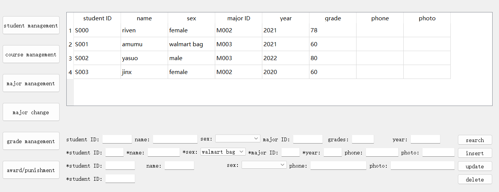
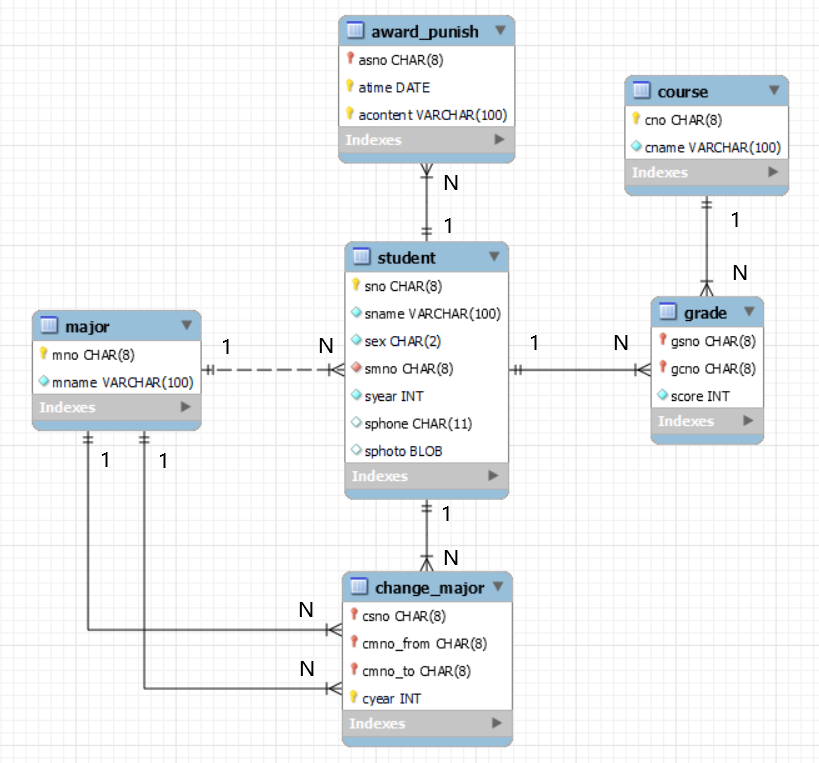
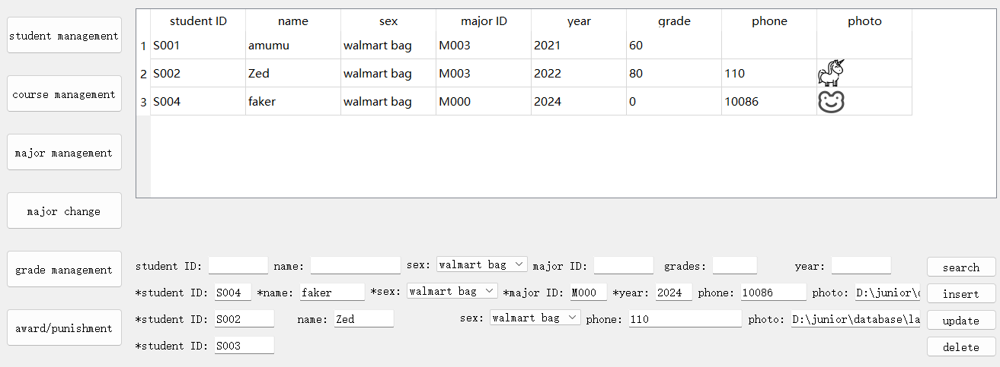
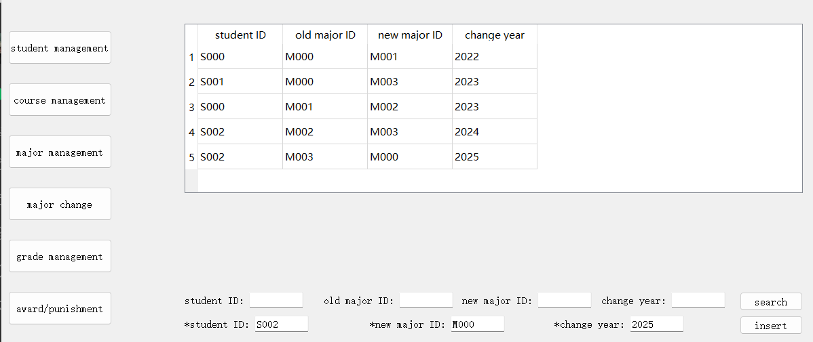
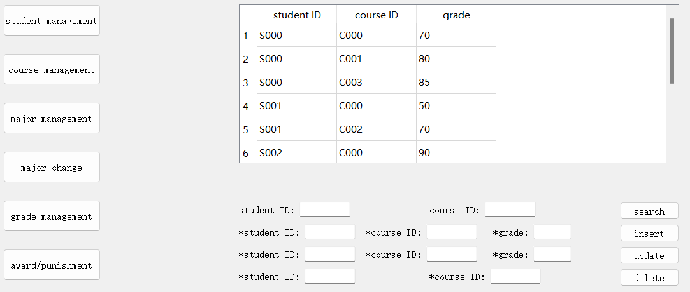
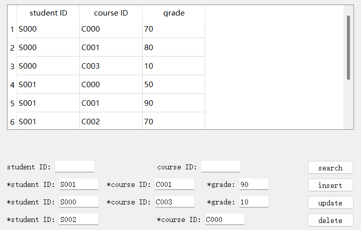
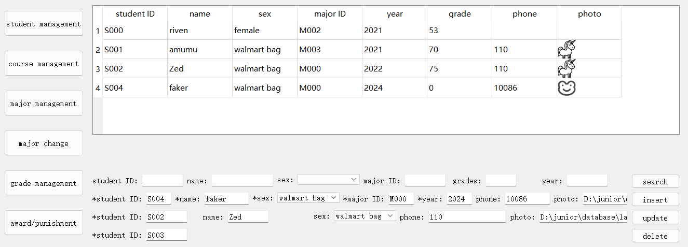
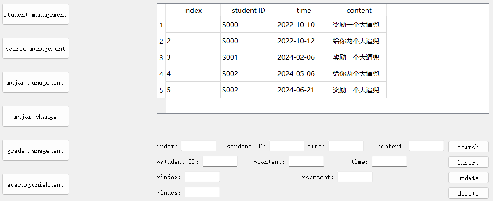

<div style="text-align:center;font-size:2em;font-weight:bold">中国科学技术大学计算机学院</div>

<div style="text-align:center;font-size:2em;font-weight:bold">《数据库系统实验报告》</div>


<div style="display: flex;flex-direction: column;align-items: center;font-size:2em">
<div>
<p>实验题目：学籍管理系统</p>
<p>学生姓名：张默涵</p>
<p>学生学号：PB21030906</p>
<p>完成时间：2024年6月21日</p>
</div>
</div>


<div style="page-break-after:always"></div>

## 需求分析

设计学生管理系统，支持学生基本信息，课程信息，专业信息，专业变更，成绩，奖惩等信息的增删改查。支持图像的数据处理

## 总体设计

#### 系统模块结构

前端：

1. 界面左边是纵向的功能选择栏，有六个按钮，对应六个table。右边页面是选择指定功能后显示部分，默认显示第一个student表，点击功能选择后会首先调用显示表的所有内容。
2. 右边页面由上下两部分组成，上面是表格，下面是操作栏。表格显示需要展示的内容，初始为表的所有内容；操作栏纵向排列每个操作，每行左边为该操作需要的输入框，右边为该操作的按钮，点击按钮后会调用相应的函数，函数会根据输入框的内容调用相应的sql语句，然后刷新表格。
3. 每个功能对应一个右边页面，每次点击功能选择按钮后会刷新右边页面，将所选页面内容显示出来，并隐藏其他页面。

后端：

1. 在数据库中定义了学生、课程、专业、专业变更、成绩、奖惩等表，包括了根据实体关系等设计的各种约束。
2. 在数据库中利用事务，存储过程、触发器、函数等定义额外的约束和封装操作，便于在前端调用。
3. 通过前端编辑框中的输入，进行分析构造sql语句，然后利用pymysql库进行数据库操作，并将结果进行呈现。

#### 系统工作流程

GUI界面如下：


左边对应六个子管理系统，点击对应按钮显示对应页面。
右边为展示和操作界面，上端为查询结果表格。下端每行为一个操作，左边为输入框，星号表示必填项，根据增删改查操作需要的输入不同进行填写，然后点击右边按钮进行操作，同时底层会刷新界面显示操作后的结果。

#### 数据库设计

* ER图如下：


* 模式分解：
由于ER图中的实体和关系已经经过优化，不需要再进行模式分解。只需要将每个实体转换为一个表格，将对应属性和约束进行对应定义即可。

* 存储过程、触发器、函数等设计思路：
在major_change上定义插入操作前的触发器进行异常检查，保证变更应满足一定的条件，具体见代码解析。

创建change_major过程，利用事务机制，在进行专业变更后，同步更新学生个人信息表中的专业。

定义cal_ave_score函数计算学生的平均成绩然后定义触发器，在更新学生成绩表时，同步更新学生个人信息表中的平均成绩。

定义删除学生的存储过程，先删除学生的专业变更、成绩、奖惩等记录，再删除学生。

上面仅举出几例，更多见源码

## 核心代码解析（可改名为对应模块，如后端实现）

#### 仓库地址

https://github.com/Riven-o/database

#### 目录

```
.
│  database.mwb --自动化生成ER图
│  database.sql --数据库代码实现
│  lab2.ui      --界面设计
│  main.py      --主程序
│  README.md
│  报告模板.md
│  报告模板.pdf
├─icon          --存放测试图像功能图标
└─src           --存放实验截图
```

数据库代码实现均在`database.sql`中，其余前端代码和后端代码实现均在`main.py`中。

#### 前端实现

前端使用PyQt5库进行实现，通过拖拽界面设计工具Qt Designer进行界面设计，然后通过pyuic5工具将.ui文件转换为.py文件，然后在这个基础上解析输入框的内容，构造sql语句，然后调用后端进行数据库操作。

对于每个功能，将左边的按钮和右边的页面连接起来，然后每个表格单独定义增删改查函数，再将对应按钮和这些功能函数联系起来，实现前后端的交互。以student表为例，连接代码如下：

```python
def show_student_page(self):
    self.table_management.setCurrentWidget(self.student_page)
    self.show_student_table()

self.btn_student.clicked.connect(self.show_student_page)
self.btn_student_search.clicked.connect(self.student_search)
```

#### 数据库实现

首先根据ER图，将每个实体转换为一个表格，然后定义对应的属性和约束，以最复杂的student表为例（根据约束条件定义主键，非空，外键等，sphoto使用base64对图像编码后存储）：

```sql
create table student(
    sno char(8) primary key,
    sname varchar(100) not null,
    sex char(20) not null,
    smno char(8) not null,
    syear int not null,
    sgrade int not null default 0,
    sphone char(11),
    sphoto blob,
    foreign key (smno) references major(mno)
);
```

然后在数据库中定义存储过程、触发器、函数等，通过封装使得前端可以直接调用。

1. 比如定义专业存储过程，利用事务机制，保证专业变更的同时更新学生的专业号：

    ```sql
    create procedure change_major(
        in psno char(8),
        in pmno_to char(8),
        in pyear int
    )
    begin
        declare exit handler for sqlexception
        begin
            rollback;
            resignal;
        end;
        
        start transaction;
        insert into major_change values (psno, (select smno from student where sno = psno), pmno_to, pyear);
        update student set smno = pmno_to where sno = psno;
        commit;
    end;
    ```

2. 定义函数计算学生的平均成绩，用于在触发器中调用，方便代码复用，通过查询对应学生的所有成绩表中记录然后求平均值返回：

    ```sql
    create function cal_ave_score(
        fsno char(8)
    )
    returns decimal(5,2)
    reads sql data
    begin
        declare total_score decimal(10,2);
        declare course_count int;
        select sum(score), count(*) into total_score, course_count from grade where gsno = fsno;
        if course_count > 0 then
            return total_score / course_count;
        else
            return 0;
        end if;
    end;
    ```

3. 定义触发器保证更新学生成绩表时，同步更新学生个人信息表中的平均成绩，以插入新的课程成绩为例：

    ```sql
    create trigger update_ave_grade_insert
    after insert on grade
    for each row
    begin
        declare ave_score decimal(5,2);
        set ave_score = cal_ave_score(new.gsno);
        update student set sgrade = ave_score where sno = new.gsno;
    end;
    ```

#### 后端实现

定义一个执行sql的函数，方便调用。查询操作没有values参数来构造sql，所以返回查询结果；更新操作将values参数传入，避免手动构造字符串导致sql注入，且不需要返回结果：

```python
def exec_sql(self, sql, values=None):
    with self.db.cursor() as cursor:
        if values:
            cursor.execute(sql, values)
        else:
            cursor.execute(sql)
            return cursor.fetchall()
```

定义一个展示表格的函数，方便操作得到结果后进行展示复用，传入打印的表，需要展示的结果，以及对应的表头，根据Qt中设计的插件进行赋值显示：

```python
def show_table(self, table, results, header):
    table.setRowCount(len(results))
    table.setColumnCount(len(header))
    for i, result in enumerate(results):
        for j, value in enumerate(result):
            if value is not None:
                table.setItem(i, j, QTableWidgetItem(str(value)))
    table.setHorizontalHeaderLabels(header)
```

不同表格查询函数处理相似，以最复杂的student表为例。首先获取文本框内容，然后根据输入的条件构造sql，由于语法原因，要判断的边界条件较多。然后通过try进行执行sql语句，最后将结果设置到对应的器件示例中，注意对图像的专门处理，同时捕获了可能异常并进行提示。查询函数如下：

```python
def student_search(self):
    sno = self.sno_search.text()
    sname = self.sname_search.text()
    sex = self.sex_search.currentText()
    smno = self.smno_search.text()
    sgrade = self.sgrade_search.text()
    syear = self.syear_search.text()

    name_dict = {0: 'sno', 1: 'sname', 2: 'sex', 3: 'smno', 4: 'sgrade', 5: 'syear'}
    conditions = [sno, sname, sex, smno, sgrade, syear]
    exist_len = len([_ for _ in conditions if _])
    sql = 'select * from student'
    if exist_len > 0:
        first = True
        for i, condition in enumerate(conditions):
            if condition:
                if first == True:
                    sql += f' where {name_dict[i]} = \'{condition}\''
                    first = False
                else:
                    sql += f' and {name_dict[i]} = \'{condition}\''
    try:
        results = self.exec_sql(sql)
        if not results:
            QMessageBox.information(self, 'tips', 'No record meets the conditions')
        else:
            self.student_table.setRowCount(len(results))
            self.student_table.setColumnCount(8)
            for i, result in enumerate(results):
                for j, value in enumerate(result):
                    if value is not None:
                        if j != 7:
                            self.student_table.setItem(i, j, QTableWidgetItem(str(value)))
                        else:
                            blob = base64.b64decode(value)
                            pixmap = QPixmap()
                            pixmap.loadFromData(blob)
                            # item = QTableWidgetItem()
                            # item.setData(Qt.DecorationRole, pixmap.scaled(self.student_table.columnWidth(j), self.student_table.rowHeight(i), Qt.KeepAspectRatio, Qt.SmoothTransformation))
                            # self.student_table.setItem(i, j, item)
                            label = QLabel()
                            label.setPixmap(pixmap.scaled(self.student_table.columnWidth(j), self.student_table.rowHeight(i), Qt.KeepAspectRatio, Qt.SmoothTransformation))
                            self.student_table.setCellWidget(i, j, label)
            header = ['student ID', 'name', 'sex', 'major ID', 'year', 'grade', 'phone', 'photo']
            self.student_table.setHorizontalHeaderLabels(header)
    
    except Exception as e:
        QMessageBox.information(self, 'tips', f'Error when searching student:\n{e}')
```

类似的，学生表格插入除去输入，异常处理等的核心代码如下，根据输入的值构造sql语句，然后执行

```python
if sno and sname and sex and smno and syear:
    insert_label = '(sno, sname, sex, smno, syear, sgrade'
    insert_value = list((sno, sname, sex, smno, syear, 0))
    if sphone:
        insert_label += ', sphone'
        insert_value.append(sphone)
    if sphoto:
        with open(sphoto, 'rb') as f:
            blob = base64.b64encode(f.read())
        insert_label += ', sphoto'
        insert_value.append(blob)
    insert_label += ')'
    sql = f'insert into student {insert_label} values ({", ".join(["%s"]*len(insert_value))})'
    try:
        self.exec_sql(sql, insert_value)
        self.db.commit()
        self.show_student_table()
```

对于更新操作，与之插入类似，区别更多在于如何构造出更新的sql语句，这里不再赘述。

对于调用数据库中编写好的过程的后端实现更为容易，同样从输入框中解析出参数，然后直接构造调用过程的sql语句，然后执行即可，比如学生删除中获取学号然后构造调用语句直接执行：

```python
sno = self.sno_delete.text()
if sno:
    sql = 'call delete_student(%s)'
    try:
        self.exec_sql(sql, sno)
        self.db.commit()
        self.show_student_table()
```

其他表格的处理类似，更多的是在对各自输入的处理和构造sql语句上有所不同，故不再赘述。

## 实验与测试

#### 依赖

依赖库：PyQt5，pymysql，base64等
运行环境：windows，python==3.11.9

#### 部署

配好环境直接`python main.py`

#### 实验结果

简单以student表为例，测试增删改查，初始状态已经由上面图给出，现在按照输入框内容依次进行增，改，删，最后按照性别查询结果如下，加入了图像的处理：


进行专业修改，原始状态已经存在四条记录，现在加一条对S002的专业更新，如下图：


原始成绩表如下：


依次按照图中插入，更新，删除操作后成绩表如下：


完成上述操作后重新打印学生记录表，观察专业变更，和成绩表变更导致的平均成绩变换均正确，说明了存储过程，触发器，函数等的正确性。


最后奖惩界面数据库初始状态展示如下，由于增删改查结果同之前类似，不再测试：


## 参考

主要参考来自网上的博客，直接搜索`pyqt+mysql`，大部分时间花在理解如何将前端和后端连接起来。一个学习Qt不错的[博客](https://blog.l0v0.com/posts/bea01990.html)
